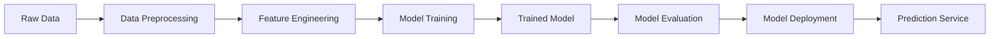

## 📊 Batch Machine Learning

### What is Batch Machine Learning?

Batch machine learning is a traditional approach where the model is trained on a complete dataset at once, rather than processing data incrementally. The entire training dataset is loaded into memory, and the model learns from all available data simultaneously.

---

### **Characteristics of Batch Learning**

* **Complete Dataset Processing**: All training data is processed together
* **Offline Training**: Model training happens before deployment
* **Static Model**: Once trained, the model remains unchanged until retrained
* **Memory Intensive**: Requires sufficient memory to hold entire dataset
* **Computational Efficiency**: Can leverage vectorized operations and parallel processing

---

### **Batch Learning Workflow**



---

### **Advantages of Batch Learning**

* **📈 High Accuracy**: Can learn complex patterns from complete dataset
* **🔄 Reproducible**: Same data always produces same results
* **⚡ Efficient Training**: Optimized algorithms for large datasets
* **🎯 Feature Engineering**: Can perform complex feature transformations
* **📊 Comprehensive Analysis**: Full dataset available for EDA and validation

---

### **Disadvantages of Batch Learning**

* **💾 Memory Constraints**: Limited by available RAM
* **⏰ Training Time**: Can be slow for very large datasets
* **🔄 Inflexible**: Cannot adapt to new data without retraining
* **💰 Resource Intensive**: Requires significant computational resources
* **📉 Concept Drift**: Model may become outdated over time

---

### **When to Use Batch Learning**

* **Large, Static Datasets**: When you have a complete dataset that doesn't change frequently
* **Complex Models**: Deep learning, ensemble methods, or sophisticated algorithms
* **Research & Development**: Prototyping and experimentation phases
* **Batch Predictions**: When predictions can be made in batches rather than real-time
* **Resource Availability**: When sufficient computational resources are available

---

### **Batch Learning Techniques**

#### **1. Data Batching Strategies**
* **Full Batch**: Process entire dataset at once
* **Mini-Batch**: Process data in smaller chunks (e.g., 32, 64, 128 samples)
* **Stochastic**: Process one sample at a time (rare in practice)

#### **2. Memory Management**
* **Data Streaming**: Load data in chunks when memory is limited
* **Data Compression**: Use efficient data formats (parquet, hdf5)
* **Garbage Collection**: Clear unused variables during training

#### **3. Parallel Processing**
* **Multi-Core Training**: Utilize multiple CPU cores
* **GPU Acceleration**: Leverage GPU for matrix operations
* **Distributed Training**: Use multiple machines for very large datasets

---

### **Batch Learning vs Online Learning**

| Aspect | Batch Learning | Online Learning |
|--------|---------------|-----------------|
| **Data Processing** | Complete dataset at once | One sample at a time |
| **Memory Usage** | High (entire dataset) | Low (single sample) |
| **Training Speed** | Slower | Faster per sample |
| **Model Updates** | Periodic retraining | Continuous updates |
| **Accuracy** | Generally higher | May be lower initially |
| **Resource Requirements** | High | Low |
| **Use Cases** | Static data, complex models | Streaming data, real-time |

---

### **Implementation Examples**

#### **Python Libraries for Batch Learning**
```python
# Scikit-learn for traditional ML
from sklearn.ensemble import RandomForestClassifier
from sklearn.model_selection import train_test_split

# TensorFlow/Keras for deep learning
import tensorflow as tf
from tensorflow import keras

# PyTorch for deep learning
import torch
import torch.nn as nn

# Pandas for data manipulation
import pandas as pd
import numpy as np
```

#### **Basic Batch Training Example**
```python
# Load complete dataset
data = pd.read_csv('large_dataset.csv')

# Preprocess data
X = data.drop('target', axis=1)
y = data['target']

# Split into train/test
X_train, X_test, y_train, y_test = train_test_split(X, y, test_size=0.2)

# Train model on complete training set
model = RandomForestClassifier(n_estimators=100)
model.fit(X_train, y_train)

# Evaluate on test set
predictions = model.predict(X_test)
```

---

### **Best Practices for Batch Learning**

* **🔄 Regular Retraining**: Schedule periodic model updates
* **📊 Data Versioning**: Track dataset versions and changes
* **⚡ Resource Monitoring**: Monitor CPU, memory, and GPU usage
* **🎯 Validation Strategy**: Use proper cross-validation techniques
* **📈 Performance Tracking**: Monitor model performance over time
* **💾 Data Storage**: Use efficient storage formats for large datasets

---

### **Challenges and Solutions**

| Challenge | Solution |
|-----------|----------|
| **Memory Limitations** | Use data streaming or cloud computing |
| **Long Training Times** | Implement early stopping and checkpointing |
| **Data Quality Issues** | Robust data validation and cleaning |
| **Model Drift** | Regular retraining and monitoring |
| **Scalability** | Distributed training and cloud resources |
