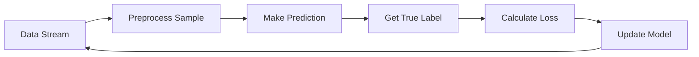

# Online Machine Learning

## 🚀 What is Online Machine Learning?

Online machine learning (incremental/streaming learning) updates model parameters in real-time as new data arrives, without retraining on the entire dataset.

---

## 🔄 **Key Characteristics**

* **Real-time Learning**: Updates with each new data point
* **Memory Efficient**: Stores only current model state
* **Adaptive**: Handles concept drift and changing distributions
* **Scalable**: Processes infinite data streams
* **Low Latency**: Fast predictions and updates

---

## 📊 **Online Learning Workflow**



---

## ✅ **Advantages vs Disadvantages**

| ✅ **Advantages** | ❌ **Disadvantages** |
|------------------|---------------------|
| Real-time adaptation | Potential instability |
| Memory efficient | Stochastic results |
| Continuous learning | Limited analysis |
| Handles concept drift | Complex tuning |
| Cost effective | Slower convergence |

---

## 🎯 **When to Use**

* **Real-time Applications**: Live predictions, recommendations
* **Data Streaming**: IoT sensors, social media, financial data
* **Limited Resources**: Memory/computational constraints
* **Dynamic Environments**: Changing data patterns
* **Large-scale Systems**: Expensive retraining scenarios

---

## 🔧 **Key Algorithms**

### **1. Stochastic Gradient Descent (SGD)**
```python
def sgd_update(model, x, y, lr=0.01):
    pred = model.predict(x)
    error = y - pred
    gradient = -2 * error * x
    model.weights -= lr * gradient
```

### **2. Passive-Aggressive (PA)**
* **Passive**: No update when prediction is correct
* **Aggressive**: Strong update when prediction is wrong

### **3. Follow the Regularized Leader (FTRL)**
* Combines regularization with adaptive learning rates
* Popular in large-scale systems

---

## 📊 **Online vs Batch Learning**

| Aspect | Online Learning | Batch Learning |
|--------|----------------|----------------|
| **Data Processing** | One sample at a time | Complete dataset |
| **Memory Usage** | Very low | High |
| **Model Updates** | Continuous | Periodic |
| **Accuracy** | May be lower initially | Generally higher |
| **Concept Drift** | Handles well | Requires retraining |

---

## 🛠️ **Implementation Examples**

### **Basic Example (scikit-learn)**

```python
from sklearn.linear_model import SGDClassifier
import numpy as np

clf = SGDClassifier(loss='hinge', eta0=0.01)

for i in range(1000):
    X_new = np.random.randn(1, 10)
    y_new = np.random.choice([0, 1])
    clf.partial_fit(X_new, y_new, classes=[0, 1])
```

### **Advanced Example (River)**
```python
from river import linear_model, preprocessing, metrics

model = linear_model.LogisticRegression()
scaler = preprocessing.StandardScaler()
metric = metrics.Accuracy()

for i in range(1000):
    x = {'f1': np.random.randn(), 'f2': np.random.randn()}
    y = 1 if x['f1'] + x['f2'] > 0 else 0
    
    x_scaled = scaler.learn_one(x).transform_one(x)
    y_pred = model.predict_one(x_scaled)
    model.learn_one(x_scaled, y)
```

---

## 🎛️ **Key Parameters**

* **Learning Rate (η)**: High = fast learning/unstable, Low = stable/slow
* **Regularization**: L1 (sparse), L2 (stable), Elastic Net (both)
* **Batch Size**: Online (1 sample) vs Mini-batch (balance)

---

## 📈 **Performance Monitoring**

### **Metrics**
* Accuracy, Precision/Recall, RMSE/MAE
* Concept drift detection

### **Monitoring Strategy**
```python
window_size = 100
accuracy_window = []

for x, y in data_stream:
    pred = model.predict(x)
    accuracy_window.append(pred == y)
    
    if len(accuracy_window) > window_size:
        accuracy_window.pop(0)
    
    if i % 50 == 0:
        print(f"Accuracy: {np.mean(accuracy_window):.3f}")
```

---

## 🚨 **Challenges & Solutions**

| Challenge | Solution |
|-----------|----------|
| **Concept Drift** | Adaptive learning rates, ensemble methods |
| **Noise Sensitivity** | Robust loss functions, regularization |
| **Parameter Tuning** | Adaptive hyperparameters |
| **Memory Management** | Efficient data structures |
| **Scalability** | Distributed learning, model compression |

---

## 🔄 **Concept Drift Handling**

### **Types**
* **Sudden**: Abrupt changes
* **Gradual**: Slow changes
* **Recurring**: Repeating patterns

### **Detection**
```python
from river.drift import ADWIN
detector = ADWIN()

for x, y in data_stream:
    detector.update(y)
    if detector.drift_detected:
        print("Concept drift detected!")
```

---

## 🎯 **Real-world Applications**

* **Recommendation Systems**: Netflix, Amazon, Spotify
* **Fraud Detection**: Credit card transactions
* **IoT & Sensors**: Smart cities, industrial monitoring
* **Social Media**: Content filtering, trend prediction
* **Financial Trading**: Algorithmic trading, risk assessment
* **Healthcare**: Patient monitoring, disease prediction
---